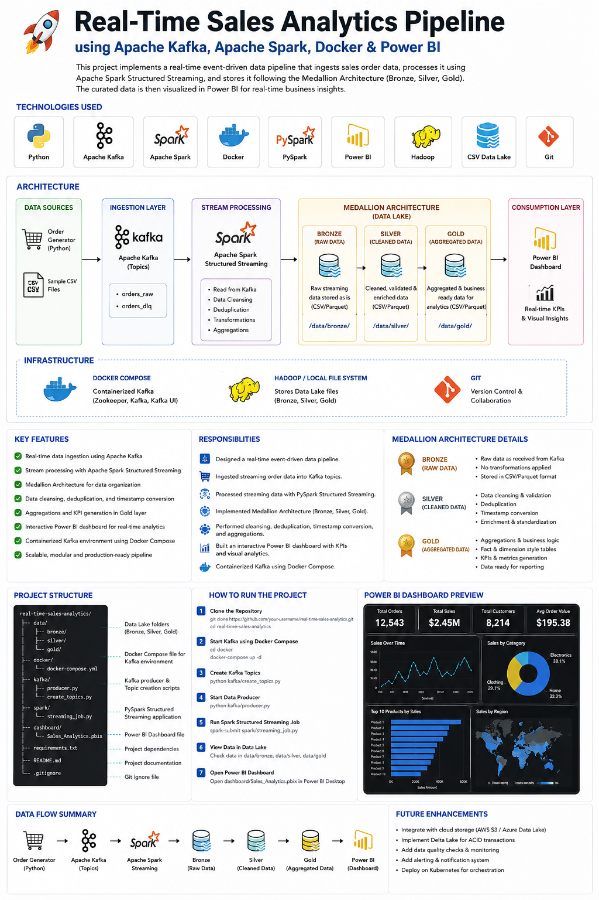

# Real-Time Sales Analytics Pipeline 🚀

## 📌 Project Overview

This project is a **Real-Time Sales Analytics Pipeline** built using **Apache Kafka, Apache Spark Structured Streaming, Docker, PySpark, Hadoop, CSV Data Lake, and Power BI**.

The pipeline ingests real-time sales order data into Kafka topics, processes the streaming data using PySpark Structured Streaming, stores the processed data using **Medallion Architecture** in **Bronze, Silver, and Gold layers**, and visualizes business KPIs in Power BI.

---

## 🏗️ Architecture



```text
Order Data Producer
        ↓
Apache Kafka Topic
        ↓
Apache Spark Structured Streaming
        ↓
Bronze Layer - Raw Data
        ↓
Silver Layer - Cleaned Data
        ↓
Gold Layer - Aggregated Data
        ↓
Power BI Dashboard
```

---

## 🛠️ Technologies Used

- Python
- Apache Kafka
- Apache Spark Structured Streaming
- PySpark
- Docker
- Docker Compose
- Hadoop
- CSV Data Lake
- Power BI
- Git & GitHub

---

## 🥉 Bronze Layer

The **Bronze Layer** stores raw streaming sales order data received from Kafka.

### Purpose

- Store raw order events
- Keep original data for backup
- Support future reprocessing
- Maintain source-level data

---

## 🥈 Silver Layer

The **Silver Layer** contains cleaned and transformed data.

### Transformations Performed

- Removed duplicate records
- Cleaned invalid records
- Converted timestamp columns
- Standardized data format
- Prepared data for analysis

---

## 🥇 Gold Layer

The **Gold Layer** contains aggregated and business-ready data.

### Metrics Created

- Total Orders
- Total Revenue
- Average Order Value
- City-wise Revenue
- Highest Sales
- Lowest Sales

---

## 📊 Power BI Dashboard

An interactive Power BI dashboard was created to analyze sales performance and business KPIs.

### Dashboard Includes

- Total Revenue
- Total Orders
- Average Order Value
- City-wise Sales
- Sales Trends
- KPI Cards
- Visual Analytics

---

## 👩‍💻 Responsibilities

- Designed a real-time event-driven data pipeline
- Ingested streaming order data into Kafka topics
- Processed streaming data using PySpark Structured Streaming
- Implemented Medallion Architecture: Bronze, Silver, Gold
- Performed data cleansing, deduplication, timestamp conversion, and aggregations
- Built an interactive Power BI dashboard with KPIs and visual analytics
- Containerized Kafka environment using Docker Compose
- Managed project version control using Git and GitHub

---

## 📁 Project Structure

```text
REALTIME-STREAMING/
│
├── bronze/
│   ├── checkpoint/
│   ├── checkpoint_kafka_to_bronze/
│   └── orders/
│
├── consumer/
│   └── consumer.py
│
├── docker/
│   └── docker-compose.yml
│
├── gold/
│   └── orders/
│       ├── _SUCCESS
│       ├── ._SUCCESS.crc
│       ├── part-00000-*.csv
│       └── .part-00000-*.crc
│
├── images/
│   └── Architecture1.png.png
│
├── powerbi/
│   └── OrdersDB.pbix
│
├── producer/
│   └── producer.py
│
├── silver/
│   ├── checkpoint/
│   └── orders/
│
├── spark_jobs/
│   ├── bronze_to_silver.py
│   ├── kafka_to_bronze.py
│   └── silver_to_gold.py
│
├── gitignore.txt
└── README.md
```
---

## ⚙️ How to Run the Project

### 1. Start Kafka using Docker

```bash
docker-compose up -d
```

### 2. Run the Data Producer

```bash
python producer/producer.py
```

### 3. Run Spark Streaming Job

```bash
spark-submit spark_jobs/bronze_to_silver.py
```

### 4. Run Gold Layer Aggregation

```bash
spark-submit spark_jobs/silver_to_gold.py
```

### 5. Open Power BI Dashboard

Open the Power BI file and connect it with the Gold Layer output data.

---

## 🎯 Project Outcome

This project demonstrates how real-time sales data can be ingested, processed, cleaned, aggregated, and visualized using modern Data Engineering tools.

It shows practical implementation of:

- Real-time data streaming
- Kafka-based ingestion
- Spark Structured Streaming
- Medallion Architecture
- CSV Data Lake storage
- Power BI reporting

---

## 👤 Author

**Vedanti Rohankar**

Data Analyst | Power BI Developer | Aspiring Data Engineer

---

## 🔗 GitHub Repository

```text
https://github.com/vedantirohankar/RealTime-Streaming-Project
```
